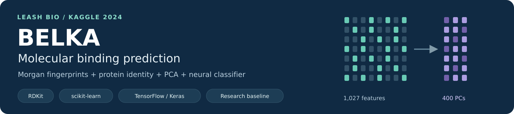
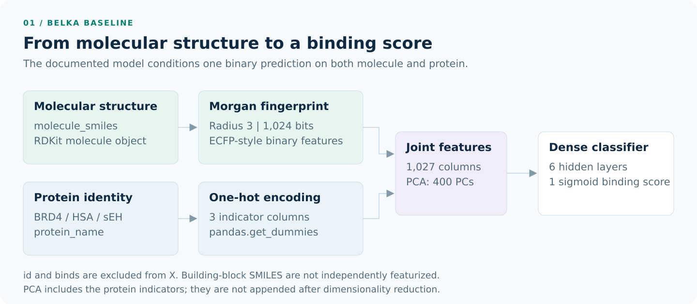
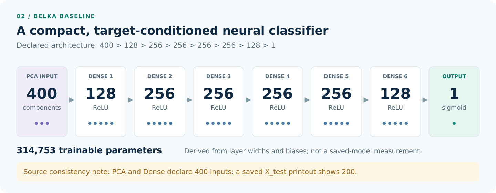
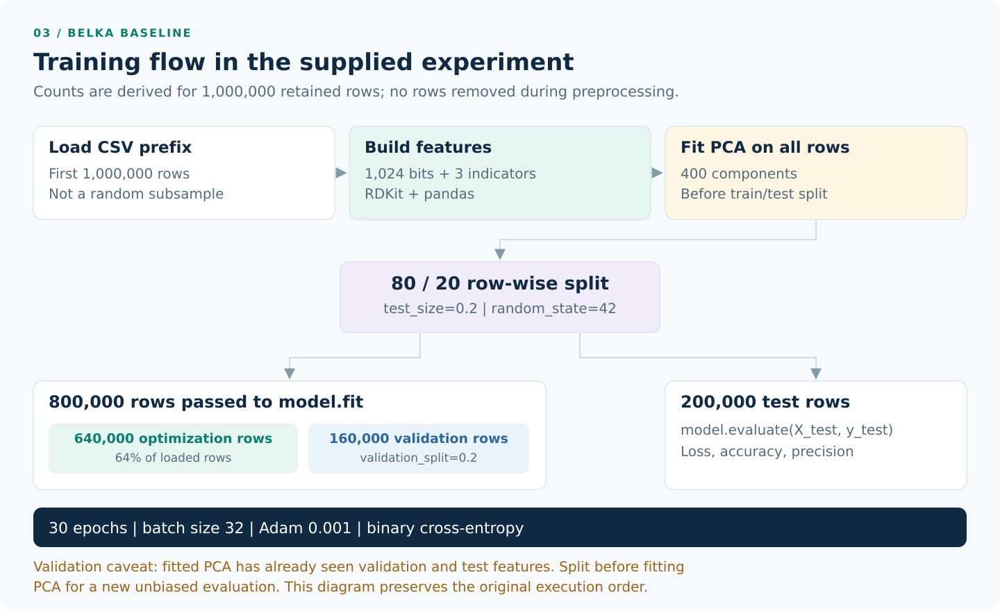
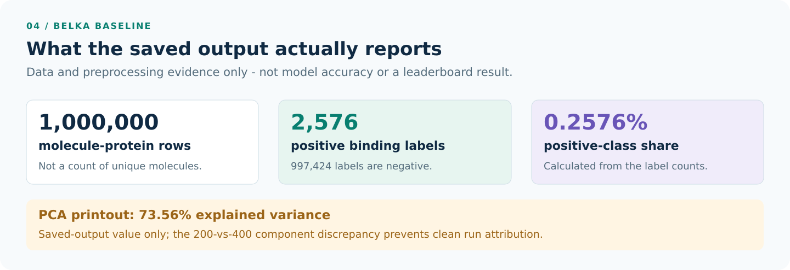

<p align="center">
  
</p>

# BELKA | Molecular Binding Prediction

**A fingerprint-based neural baseline for Leash Bio's Kaggle competition.**

This project explores small-molecule binding prediction using a combination of cheminformatics, dimensionality reduction, and supervised learning. Molecular SMILES are converted into **1,024-bit Morgan fingerprints**, combined with **protein identity**, projected into **400 principal components**, and passed to a **TensorFlow/Keras dense neural network** that produces one binding score per molecule-protein pair. [Source: architecture excerpt][source]

**Stack:** Python / pandas / RDKit / scikit-learn / TensorFlow-Keras  
**Approach:** molecular fingerprints + one-hot protein indicators + PCA + binary classification  
**Status:** exploratory architecture and preprocessing are documented; predictive scores and a submission pipeline are not present in the reference.

[Competition context](#competition-context) | [Architecture](#architecture) | [Training](#training) | [Getting started](#getting-started) | [Results and limitations](#results-and-limitations)

## Competition context

[**NeurIPS 2024 - Predict New Medicines with BELKA**][competition] was hosted by **Leash Bio** on Kaggle, with a competition window of **April 4-July 8, 2024**. BELKA stands for **Big Encoded Library for Chemical Assessment**. The challenge asked participants to predict whether small molecules bind to specified protein targets. [Competition overview][competition]

The documented experiment includes the target labels **BRD4**, **HSA**, and **sEH**. A row represents a molecule paired with one protein and a binary `binds` label. This implementation predicts that binary binding label; it is not a docking model or a predictor of a measured affinity constant. [Architecture excerpt][source]

**Competition scoring is not plain accuracy or threshold precision.** Kaggle specifies average precision for each **(protein, split group)**, then averages those values into the final score. The notebook instead monitors accuracy and Keras `Precision()`; it does not implement the complete competition metric. [Official evaluation description][competition]

## Data and representation

The experiment loads the **first 1,000,000 rows** of `train.csv` using `pd.read_csv(..., nrows=1000000)`. The preceding comment says 100,000, but the executed statement requests one million, and the displayed table contains one million rows. These are **rows, not necessarily unique molecules**, and the prefix is not a random sample. [Architecture excerpt][source]

| Field | Role in the documented pipeline |
| :--- | :--- |
| `molecule_smiles` | Parsed by RDKit and converted to a molecular fingerprint. |
| `protein_name` | Encoded into three numeric protein indicators. |
| `binds` | Binary training label; removed from the feature matrix. |
| `id` | Row identifier; also removed from the feature matrix. |
| `buildingblock1_smiles`, `buildingblock2_smiles`, `buildingblock3_smiles` | Present in the data preview, but not independently featurized by this model. |

The numeric table has **1,029 columns**: 1,024 fingerprint bits, three protein indicators, `id`, and `binds`. Removing the identifier and label leaves **1,027 model features before PCA**. These dimensions follow directly from the supplied preprocessing code. [Architecture excerpt][source]

### Molecular fingerprints

The reference uses the following RDKit helper:

```python
from rdkit.Chem import AllChem

def generate_ecfp(molecule, radius=3, bits=1024):
    if molecule is None:
        return None
    return list(
        AllChem.GetMorganFingerprintAsBitVect(
            molecule, radius, nBits=bits
        )
    )
```

Morgan fingerprints summarize local molecular environments as a fixed-size representation. Here, the representation is a **binary bit vector**, with **radius 3** and **1,024 bits**, rather than a count fingerprint or a learned graph embedding. The source calls these features ECFPs; this README retains that terminology while identifying the actual RDKit implementation. [RDKit documentation][rdkit]

### Protein conditioning and PCA

`pd.get_dummies` generates indicators for BRD4, HSA, and sEH. The indicators are concatenated with the fingerprint bits **before PCA**. Thus, protein information is part of the joint projection; there is no separate protein encoder or post-PCA concatenation branch. [Architecture excerpt][source]

The code declares `PCA(n_components=400)`. Although `StandardScaler` is imported, no scaling call is shown. scikit-learn PCA centers its inputs but does not automatically scale each feature to unit variance. [PCA reference][pca]

## Architecture



This is a **single target-conditioned binary classifier**. The same dense network handles all three protein labels through its input features and outputs one sigmoid score, not three simultaneous protein-specific outputs. [Architecture excerpt][source]



| Stage | Width / activation | Trainable parameters, derived |
| :--- | :--- | ---: |
| PCA input | 400 components | Not part of the neural parameter count |
| Dense 1 | 128 / ReLU | 51,328 |
| Dense 2 | 256 / ReLU | 33,024 |
| Dense 3 | 256 / ReLU | 65,792 |
| Dense 4 | 256 / ReLU | 65,792 |
| Dense 5 | 256 / ReLU | 65,792 |
| Dense 6 | 128 / ReLU | 32,896 |
| Output | 1 / sigmoid | 129 |
| **Total** | **6 hidden layers + 1 output layer** | **314,753** |

The count is calculated from the declared layer widths, including biases: `(input_width + 1) * output_width` for each dense layer. It is **not** a measurement from a supplied saved model. [Architecture excerpt][source]

<details>
<summary><strong>Model definition from the experiment</strong></summary>

```python
from tensorflow.keras.models import Sequential
from tensorflow.keras.layers import Dense
from tensorflow.keras.optimizers import Adam
from tensorflow.keras.metrics import Precision

model = Sequential()
model.add(Dense(128, input_dim=400, activation='relu'))
model.add(Dense(256, activation='relu'))
model.add(Dense(256, activation='relu'))
model.add(Dense(256, activation='relu'))
model.add(Dense(256, activation='relu'))
model.add(Dense(128, activation='relu'))
model.add(Dense(1, activation='sigmoid'))

model.compile(
    optimizer=Adam(learning_rate=0.001),
    loss='binary_crossentropy',
    metrics=['accuracy', Precision()]
)
```

`Dropout`, `EarlyStopping`, and `RandomForestClassifier` appear in the import block, but are not used in the shown model or training call. No graph neural network, transformer, ensemble, or docking stage is implemented in this excerpt.

</details>

> **Source consistency note:** PCA and the dense input both declare **400** dimensions, but a saved `X_test.columns` output lists only **200** components. The diagrams describe the declared 400-component architecture. The mixed output does not establish which configuration produced a completed run; inspect live shapes and rerun the preprocessing cells before training.

## Training



The supplied order is: load the CSV prefix, build fingerprints and protein indicators, fit PCA, split the projected data, train the dense network, and call `model.evaluate`. The diagram preserves this order, including the **PCA-before-split validation issue** discussed below. [Architecture excerpt][source]

| Setting | Value in the supplied code |
| :--- | :--- |
| Initial row cap | 1,000,000 |
| Fingerprint | Morgan bit vector; radius 3; 1,024 bits |
| Protein representation | Three one-hot indicators |
| PCA dimension | 400 declared; 200 in one saved printout |
| Outer split | `test_size=0.2`, `random_state=42`; no `stratify` argument |
| Internal validation | `validation_split=0.2` of the outer training partition |
| Optimizer | Adam |
| Learning rate | 0.001 |
| Loss | Binary cross-entropy |
| Monitored metrics | Accuracy and Keras precision |
| Training call | 30 epochs; batch size 32 |
| Training callbacks / class weighting | Not passed in the shown call |

With all one million rows retained, the split settings imply **640,000 optimization rows**, **160,000 validation rows**, and **200,000 test rows**. Those are derived counts, not printed split statistics. Keras takes its validation fraction from the end of the arrays supplied to `fit`, before training-time shuffling. [Keras training API][keras-fit]

The reference calls:

```python
history = model.fit(
    X_train, y_train,
    validation_split=0.2,
    epochs=30,
    batch_size=32
)

loss, accuracy, precision = model.evaluate(X_test, y_test)
```

Epoch logs, runtime measurements, and the resulting evaluation values were not included. Thirty epochs is the **configured training request**, not verified evidence that a run completed.

## Getting started

### Environment

The packages below are inferred from the supplied imports. Exact Python and package versions were not recorded, so this is a dependency starting point rather than a tested environment lockfile.

```bash
python -m pip install pandas numpy rdkit scikit-learn tensorflow duckdb jupyterlab
python -m jupyter lab
```

DuckDB is included because the reference imports it; the shown loading path uses pandas instead. No trained weights, data files, or executable training entrypoint are included in this documentation package. The preserved [architecture excerpt][source] contains code cells interleaved with saved output.

### Local data

Obtain the competition data through the [Kaggle competition][competition] under its applicable terms. The original experiment points to a Windows-specific CSV path. Adjust only that location for your environment, for example:

```python
from pathlib import Path
import pandas as pd

DATA_PATH = Path('data/train.csv')
if not DATA_PATH.is_file():
    raise FileNotFoundError(f'Expected the training CSV at {DATA_PATH.resolve()}')

train_df = pd.read_csv(DATA_PATH, nrows=1_000_000)
```

The pipeline expands fingerprints into a dense table and retains molecule objects, lists, and intermediate DataFrames. Check available memory with a smaller trial load before requesting the full prefix; the excerpt does not provide a measured hardware requirement.

### Reconstructing the experiment

Open the working notebook for this project, or transfer the **code cells only** from the [reference excerpt][source] into a fresh notebook. Run the preprocessing and model cells in their displayed order to reconstruct the original experiment. Do not paste saved console output as executable code.

Before model fitting, check that the live feature width agrees with the declared network:

```python
assert X_train.shape[1] == 400, X_train.shape
assert X_test.shape[1] == 400, X_test.shape
assert model.input_shape[-1] == 400, model.input_shape
```

These are suggested checks, not cells present in the original excerpt. For a **new evaluation intended to measure generalization**, first address the split and preprocessing limitations below rather than reproducing the original validation order unchanged.

## Results and limitations

### Available evidence



| Item | Evidence available in the reference |
| :--- | :--- |
| Loaded rows | 1,000,000 displayed |
| Non-binding labels | 997,424 |
| Binding labels | 2,576 |
| Positive-label rate | 0.2576%, calculated from the displayed counts |
| PCA explained variance | 73.56% in a saved output; run/component count is not conclusively attributable |
| Test loss / accuracy / precision | Evaluation and print calls are present; values are not supplied |
| Official competition score / rank | Not supplied |

The **73.56%** figure is a preprocessing statistic, **not model accuracy**. Because the source includes inconsistent component counts, it should not be presented as a verified result for a clean 400-component rerun. [Architecture excerpt][source]

Predicting every row as non-binding would yield **99.7424% accuracy on the displayed full sample**, calculated from its label counts. That is an illustration of class imbalance, not a measured neural-model result. Neither accuracy nor Keras threshold precision is interchangeable with average precision. [Keras precision][keras-metrics] / [scikit-learn average precision][ap]

### Validation and reproducibility notes

**Preprocessing leakage.** `pca.fit_transform` runs before the outer split, so validation and test feature distributions influence the learned projection. This is preprocessing leakage even though PCA does not use `binds`. A new leakage-controlled evaluation should split first, fit PCA only on optimization data, and reuse that fitted transform on validation and test partitions. This is a proposed correction, not the supplied workflow. [scikit-learn guidance][leakage]

**Chemical overlap and sampling.** The data preview shows the same molecule paired with different proteins, while the split is row-wise. Molecules or shared building blocks can therefore occur across partitions. The excerpt does not quantify overlap or establish generalization to unseen chemistry. The first-million-row loading strategy also does not establish a representative sample of the full competition dataset. [Architecture excerpt][source]

**Invalid inputs.** `generate_ecfp` returns `None` for invalid molecules, but downstream code assumes every result has a length and expands to 1,024 bits. No explicit invalid-SMILES filtering, imputation, or rejection policy is shown. [Architecture excerpt][source]

**Reproducibility and persistence.** The train/test split has seed 42, but TensorFlow and all other randomness are not explicitly seeded. No environment lockfile, PCA serialization, saved feature-order metadata, model checkpoint, or complete inference script appears in the reference. Do not treat the excerpt as a fully reproducible end-to-end submission.

Additional source observations and clearly separated follow-up ideas are collected in [Validation notes](docs/VALIDATION_NOTES.md).

## Competition submission boundary

Kaggle's requested output is a CSV with an `id` and a probability for `binds` for each test row. The following is only a **format illustration**, not predictions from this project. [Official submission format][competition]

```csv
id,binds
295246830,0.5
295246831,0.5
```

The supplied code ends with evaluation on its local `X_test` split. It does **not** load the competition test set, persist preprocessing, generate its predictions, or write a submission CSV.

An inference implementation would need to preserve fingerprint settings, protein-indicator column order, the fitted PCA object, and the trained dense model. New data must be transformed with the existing PCA, not used to refit it. These artifacts and steps remain outside the supplied implementation. [scikit-learn preprocessing guidance][leakage]

## Documentation package

This is the layout of the accompanying documentation, not an inferred listing of unprovided repository files:

```text
README.md
docs/
  SOURCE_MAP.md
  VALIDATION_NOTES.md
  source/
    architecture_excerpt.md       # Preserved source cells and output
  assets/
    hero.svg                     # Each graphic also has a PNG copy
    feature_pipeline.svg
    model_architecture.svg
    training_workflow.svg
    data_snapshot.svg
  diagrams/
    feature_pipeline.mmd
    model_architecture.mmd
    training_workflow.mmd
    render_graphics.py            # Regenerates SVG and PNG assets
```

The README uses local SVGs, so retain `docs/assets` alongside it. The diagrams illustrate code structure and source-derived quantities; they are not experimental learning curves. To regenerate the styled assets after editing the rendering source, install `cairosvg` and run `python docs/diagrams/render_graphics.py` from the repository root.

## Attribution and scope

The competition and BELKA data are credited to **Leash Bio and the Kaggle competition organizers**. Project-specific details come from the [preserved architecture excerpt][source]; a [source map](docs/SOURCE_MAP.md) connects them to the original lines. External documentation supplies competition context and library semantics, not missing experiment results.

No software license was specified in the architecture reference. Consult or add the repository's own `LICENSE` separately, and do not assume it overrides the competition data terms. This is a research baseline for binding-label prediction, not experimental confirmation of binding, drug efficacy, or clinical suitability.

### References

- [Kaggle: NeurIPS 2024 - Predict New Medicines with BELKA][competition]
- [RDKit: Morgan / circular fingerprints][rdkit]
- [scikit-learn: PCA][pca] and [preprocessing/data-leakage guidance][leakage]
- [Keras: model training API][keras-fit] and [classification metrics][keras-metrics]
- [scikit-learn: average precision][ap]

[source]: docs/source/architecture_excerpt.md
[competition]: https://www.kaggle.com/competitions/leash-BELKA
[rdkit]: https://www.rdkit.org/docs/GettingStartedInPython.html#morgan-fingerprints-circular-fingerprints
[pca]: https://scikit-learn.org/stable/modules/generated/sklearn.decomposition.PCA.html
[leakage]: https://scikit-learn.org/stable/common_pitfalls.html#data-leakage
[keras-fit]: https://keras.io/api/models/model_training_apis/
[keras-metrics]: https://keras.io/api/metrics/classification_metrics/#precision-class
[ap]: https://scikit-learn.org/stable/modules/generated/sklearn.metrics.average_precision_score.html
